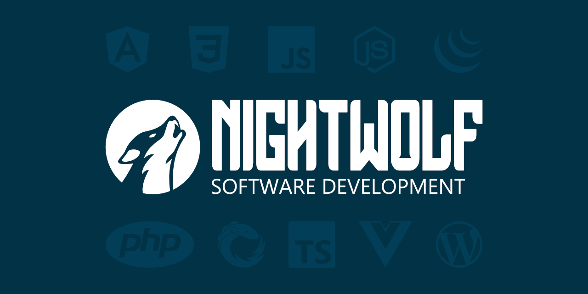

## Projects

| | |
| :---: | :---: |
|  |  |
|  |  |
|  |  |

## Interests
* Angular
* CSS
* Javascript
* Node.js
* PHP
* React
* RxJS
* SQL
* Svelte
* TypeScript
* Vue
* WordPress

## Contact Me

* [Website](https://nightwolf.dev)
* [Twitter](https://twitter.com/nightwolfdev)
* [Facebook](https://www.facebook.com/NightWolfDevelopment/)
